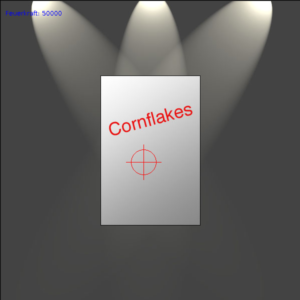
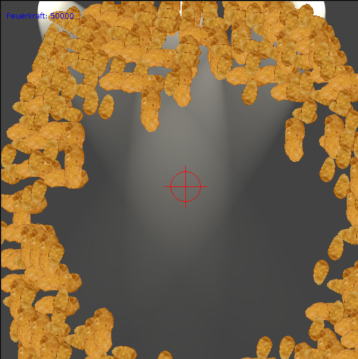

.. Copyright © 2014, 2016-2017 Martin Ueding <dev@martin-ueding.de>

##########
cornflakes
##########

This is another small game that I wrote before 2011. You shoot a box of
cornflakes and you can see them fly away in slow motion:

Download
========

This is the compiled game: `<cornflakes.jar>`_

Controls
========

.. list-table::
    :header-rows: 1

    - - Button
      - Normal
    - - Left click
      - Shoot
    - - Mouse wheel
      - Adjust shooting strength
    - - :kbd:`n`
      - Get a new box of corn flakes
    - - :kbd:`d`
      - Double shooting power
